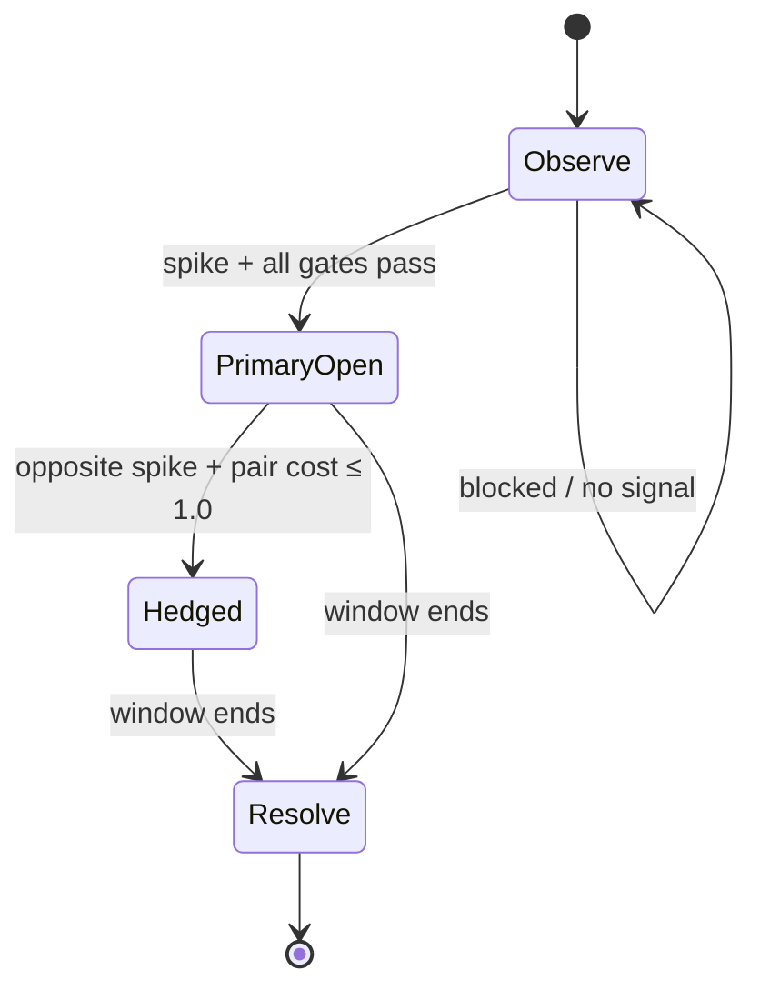

# Polymarket 5-Min BTC Spike Bot

Quantitative trading bot for Polymarket's rolling **5-minute Bitcoin Up/Down** binary markets. It listens to **Oracle** (BTC-USD lead feed) and **Chainlink BTC/USD via Polymarket RTDS** (resolution oracle), detects short-term momentum spikes, buys the **underdog** token before the book reprices, and optionally **hedges** on an opposite spike to cap downside. Positions settle at **$1 / $0** against Chainlink at window close — not exchange spot.

> **Current strategy:** single active path — **Spike Bot** (`bot/strategy/phase1.py`). Legacy end-of-window Phase 2 reversal (`END_5S_SPIKE_ENABLED: false`) is dormant. Live order routing is **not wired**; use **paper mode** for tuning.

---

## Table of contents

1. [How it works (technical)](#how-it-works-technical)
2. [System architecture](#system-architecture)
3. [Per-market state machine](#per-market-state-machine)
4. [Data feeds & synchronization](#data-feeds--synchronization)
5. [Entry gates (primary + hedge)](#entry-gates-primary--hedge)
6. [Risk, kill switch & settlement](#risk-kill-switch--settlement)
7. [Windows quick start (`.exe`)](#windows-quick-start-exe)
8. [Developer setup (Python source)](#developer-setup-python-source)
9. [Dashboard & monitoring](#dashboard--monitoring)
10. [Configuration reference](#configuration-reference)
11. [Documentation map](#documentation-map)
12. [Image guide (where to add screenshots)](#image-guide-where-to-add-screenshots)
13. [Safety & disclaimer](#safety--disclaimer)

---

## How it works (technical)

Polymarket lists a new BTC Up/Down market every **5 minutes**. At window open **`t₀`**, the strike **`S₀`** is the Chainlink BTC/USD price. At **`tₑ = t₀ + 300s`**, resolution uses Chainlink **`Sₑ`**:

| Token | Pays $1 when |
|-------|----------------|
| **UP** | `Sₑ > S₀` |
| **DOWN** | `Sₑ < S₀` |

**Coinbase moves before Chainlink** in fast markets. The bot exploits that lead-lag:

1. **Spike detection** — over a 2s window, compute Coinbase USD move and z-score vs 1s vol.
2. **Primary entry (phase 1 slot)** — if spike direction is UP/DOWN *and* that side's ask is still an underdog (**$0.25–$0.50**), *and* model EV + distance-to-strike checks pass → post a **limit buy** capped at $0.50.
3. **Hold to resolution** — no take-profit, no stop-loss on the primary.
4. **Reversal hedge (phase 2 slot)** — if an **opposite** spike fires while primary is open *and* `primary_entry + hedge_ask ≤ 1.00` → **IOC buy** matched share count on the opposite side (no-loss pair).
5. **Settlement** — at `tₑ`, open legs redeem at $1 or $0 per Chainlink outcome.


<!-- IMAGE 01: 5-min window diagram: t₀ (S₀), Coinbase spike, primary fill, optional hedge, tₑ resolution.
     Suggested: horizontal timeline with Chainlink vs Coinbase price lines diverging then converging. -->


<!-- IMAGE 02: Dual price chart showing Coinbase leading Chainlink near strike cross.
     Helps readers understand why gap is a feature, not just noise. -->

**Why underdog only (`ask ≤ 0.50`)?** The edge is buying mispriced probability before the CLOB catches up. Paying >50¢ on a spike direction usually means the market already agrees — little remaining edge.

**Why no TP/SL?** Resolution is binary; the hedge replaces a stop: when both legs fill at combined cost ≤ $1, worst-case payout is $1 regardless of direction.

---

## System architecture

```
┌─────────────────────────────────────────────────────────────────────────┐
│                           BotRunner (100ms tick)                        │
├──────────────┬──────────────┬──────────────┬──────────────┬─────────────┤
│ Feeds        │ Features     │ Strategy     │ Risk         │ Execution   │
│ RTDS CL      │ σ, μ, p_model│ Phase1Strategy│ Kelly/limits │ Paper fills │
│ Coinbase L2  │ cb_spike_z   │ primary+hedge │ kill switch  │ (live stub) │
│ Polymarket WS│ gap, sync_ok │              │ gap halt     │             │
└──────────────┴──────────────┴──────────────┴──────────────┴─────────────┘
         │                              │                    │
         └──────── SQLite (data/bot.db) ┴──── JSON status ───┘
                                              data/bot_status.json
```


<!-- IMAGE 03: Polished version of the ASCII diagram above, or a draw.io export.
     Show three external WS feeds → FeatureEngine → StrategyEngine → PaperGateway. -->

### Module map

| Path | Role |
|------|------|
| `bot/runner.py` | Async main loop: discover market → hydrate books → tick → settle |
| `bot/strategy/engine.py` | Routes ticks to `Phase1Strategy` only |
| `bot/strategy/phase1.py` | Spike primary + reversal hedge logic |
| `bot/features/feature_engine.py` | Per-tick snapshot: vol, momentum, `p_model_up`, spikes |
| `bot/features/probability.py` | GBM-style `P(UP)` from Chainlink moneyness + gap adjustment |
| `bot/feeds/price_sync.py` | Merges oracle + lead; computes `gap_usd`, `sync_ok` |
| `bot/feeds/polymarket_rtds.py` | Chainlink via `wss://ws-live-data.polymarket.com` (no API key) |
| `bot/feeds/btc_coinbase.py` | Coinbase ticker + L2 for spike / OFI |
| `bot/feeds/polymarket_ws.py` | CLOB L2 order book WebSocket |
| `bot/execution/paper.py` | Simulated limit/IOC fills with book-walk + latency |
| `bot/risk/limits.py` | Per-trade notional caps, equity floor |
| `bot/risk/kill_switch.py` | `KILL` file, feed staleness watchdog |
| `bot/persistence/db.py` | SQLite: trades, snapshots, market resolution |
| `bot/ui/api.py` | FastAPI dashboard backend |
| `config/parameters.yaml` | All strategy constants (single source of tunables) |
| `config/config.yaml` | Runtime: URLs, paths, wallet placeholders |

### Main loop (one 5-minute market)

Source: `bot/runner.py`

1. **Pick market** — nearest active BTC 5m slug via Gamma REST.
2. **Subscribe** — CLOB WS for UP/DOWN token IDs; REST hydrate initial L2.
3. **Resolve S₀** — Chainlink price at `t₀` from RTDS history; set `s0_quality`:
   - `exact` — joined within ~10s of open (**required for primary entry**)
   - `approximate` — joined mid-window → **primary entries skipped**
4. **Tick loop** (~100ms until `tₑ + 3s`):
   - Feed health gate (`KillSwitch.feeds_ok`)
   - Gap halt (blocks **new entries** only)
   - `FeatureEngine.tick()` → `FeatureSnapshot`
   - `Phase1Strategy.on_tick()` → `Signal` list
   - Risk check → paper execute (live raises warning and skips)
5. **Settlement** — both phase slots resolve at $1/$0 per Chainlink vs `S₀`.

Optional **trading schedule** (`P1_SCHEDULE_ENABLED`): sleep outside configured ET hours (default 8:00–18:00). Currently **off** for 24/7 paper collection.

---

## Per-market state machine



| State | Phase slots | Allowed actions |
|-------|-------------|-----------------|
| Observe | none | Primary entry only (max 1 signal per market) |
| Primary open | phase 1 filled | Hedge entry only |
| Hedged | phase 1 + phase 2 filled | **Nothing** — hold to resolution |
| Window end | any open | Settle at $1 / $0 |


<!-- IMAGE 04: Render the mermaid state diagram or a simple flowchart for non-GitHub viewers. -->

At most **one primary** and **one hedge** per market. `_primary_signaled` prevents duplicate primary signals even if the first limit does not fill.

---

## Data feeds & synchronization

| Feed | Source | Used for |
|------|--------|----------|
| **Oracle** | Polymarket RTDS `crypto_prices_chainlink` | `S₀`, `Sₜ`, `Sₑ`, `p_model` anchor |
| **Lead** | Coinbase WS `BTC-USD` ticker + level2 | Spike detection, momentum, OFI |
| **Market** | Polymarket CLOB REST + WS | UP/DOWN bids/asks, L2 depth |

### Synchronization (`PriceSync`)

A tick is valid when Coinbase is fresh and Chainlink is within staleness bounds:

```
sync_ok = (age_cb ≤ FEED_SYNC_MAX_MS) AND (age_cl ≤ WATCHDOG_BTC_STALE_MS)
```

Defaults: `FEED_SYNC_MAX_MS = 3500`, `WATCHDOG_BTC_STALE_MS = 12000`. Chainlink RTDS ticks are sparse, so oracle uses a longer window than Coinbase.

If `sync_ok` is false → strategy emits **no signals** (`Phase1Strategy` checks `feat.sync_ok`).

### Spike features (each tick)

Window: `P1_SPIKE_WINDOW_MS` (default **2000 ms**).

```
cb_spike_usd = last_trade - price_at_window_start
cb_spike_z   = log_return / (sigma_1s * sqrt(window_s))
```

- **UP spike:** `cb_spike_z ≥ 2.0` AND `cb_spike_usd ≥ $12`
- **DOWN spike:** `cb_spike_z ≤ -2.0` AND `cb_spike_usd ≤ -$12`

### Gap halt

```
gap_usd = coinbase_mid - chainlink_price
gap_blocked = |gap_usd| ≥ GAP_HALT_USD  OR  |gap_z| ≥ GAP_Z_HALT
```

Defaults: `GAP_HALT_USD = 100`, `GAP_Z_HALT = 10`. Blocks **new ENTER signals** only (does not force-exit). Wide gaps are normal during real lead spikes; the halt is a **data-glitch ceiling**, not a trading stop at $25.


<!-- IMAGE 05: Dashboard or terminal showing chainlink_price, coinbase_mid, gap_usd, sync_ok.
     Annotate green/red states for sync_ok and gap_blocked. -->

---

## Entry gates (primary + hedge)

### Primary (phase 1) — all must pass

| # | Gate | Parameter (default) |
|---|------|---------------------|
| 1 | Feeds synchronized | `sync_ok` |
| 2 | Not already signaled | `_primary_signaled` |
| 3 | Time remaining | `T ≥ P1_MIN_T_S` (2s) |
| 4 | Exact S₀ | `s0_quality == "exact"` |
| 5 | Spike direction | § spike features |
| 6 | Underdog price band | ask ∈ [$0.25, $0.50] |
| 7 | Distance-to-strike | `|spike_usd| ≥ 0.5 × distance_to_S₀` |
| 8 | EV gate | `p_win > ask + 0.02` |
| 9 | Liquidity | ≥ $30 within 3¢ of ask |
| 10 | Not gap-blocked | runner |
| 11 | Risk `can_open()` | notional + exposure caps |

**Order:** limit buy, price capped at `P1_ENTRY_MAX_PRICE` ($0.50), fixed **$10** notional (`P1_FIXED_NOTIONAL_USD`).

### Distance-to-strike

```
if side == UP:  needed = max(0, S₀ - chainlink_price)
if side == DOWN: needed = max(0, chainlink_price - S₀)

pass if |cb_spike_usd| ≥ P1_SPIKE_DIST_RATIO × needed   (ratio = 0.5)
```

Spike must be large relative to how far Chainlink still needs to move to be in-the-money.

### Hedge (phase 2)

Triggered when primary is open and an **opposite** spike fires:

| Gate | Default |
|------|---------|
| `P1_HEDGE_ENABLED` | true |
| Opposite ask | ≤ $0.50 |
| Pair cost | `primary_entry + hedge_ask ≤ 1.00` |
| Size | matched shares (same count as primary) |
| Order type | IOC at ask |
| Retry cooldown | 500 ms between attempts |
| Min time left | `T ≥ 1s` |


<!-- IMAGE 06: Annotated Polymarket market screenshot or dashboard trade row showing
     primary entry, opposite hedge, pair cost, and final resolution PnL. -->

Full formula reference: [`docs/SPIKE_BOT_STRATEGY.md`](docs/SPIKE_BOT_STRATEGY.md) and [`docs/STRATEGY.md`](docs/STRATEGY.md) (legacy Phase 2 sections kept for history).

---

## Risk, kill switch & settlement

| Control | Behavior |
|---------|----------|
| **Per-trade cap** | $10 primary (`P1_FIXED_NOTIONAL_USD`) |
| **Equity floor** | Stops new entries if equity < $200 |
| **Gap halt** | Blocks entries when gap extreme (see above) |
| **Kill file** | Create `KILL` in working directory → graceful stop |
| **Feed staleness** | Skips ticks; requires `WATCHDOG_RECOVERY_S` (5s) after recovery |
| **Instance lock** | `data/bot.lock` — only one bot process |
| **Daily/hourly PnL** | Logged for dashboard; **does not block entries** in paper |

Settlement (`runner._settle_open_positions`): at window end, Chainlink `Sₑ` vs `S₀` determines winner; each open leg pays $1 or $0.

**Live trading:** `bot/execution/polymarket_gateway.py` is a stub (`NotImplementedError`). Do not use `--mode live` with real funds until wired and paper-calibrated.

---

## Windows quick start (`.exe`)

The Windows build packages the bot as a standalone executable — no Python install required for end users.


<!-- IMAGE 07: Explorer screenshot of the recommended release folder structure below. -->

### Recommended release folder

Place the `.exe` and config alongside each other:

```
Polymarket_BTC_Spike_Bot/
├── PolymarketSpikeBot.exe      ← your built executable
├── config/
│   ├── config.yaml             ← copy from config/config.example.yaml
│   └── parameters.yaml         ← strategy tunables (ship defaults)
├── .env                        ← only needed for future live mode
├── scripts/
│   ├── run_paper.bat           ← optional wrapper
│   └── run_dashboard.bat
├── dashboard/                  ← optional: pre-built UI (npm run build)
├── data/                       ← created at runtime (bot.db, bot_status.json)
└── logs/                       ← created at runtime
```

### First run (paper trading)

1. **Unzip** the release folder to a path **without spaces** if possible (e.g. `C:\Bots\PolymarketSpike`).
2. **Edit** `config\config.yaml` if you need custom paths (defaults work out of the box).
3. **Double-click** `PolymarketSpikeBot.exe` — or run from PowerShell:

```powershell
cd C:\Bots\PolymarketSpike
.\PolymarketSpikeBot.exe --mode paper
```

4. **Confirm feeds** — console should show:
   - `Oracle: Polymarket RTDS Chainlink | Lead: Coinbase BTC-USD`
   - Periodic `T=…s p_up=… gap=…` lines when a market is active
5. **Stop** — `Ctrl+C` in the console, or create an empty file named `KILL` in the same folder as the exe.


<!-- IMAGE 08: Console window showing successful paper start, market slug, S₀, T countdown.
     Blur any wallet keys if visible. -->

### Other modes

```powershell
# Config smoke test (no network trading loop)
.\PolymarketSpikeBot.exe --mode dryrun

# Custom config path
.\PolymarketSpikeBot.exe --mode paper --config C:\Bots\PolymarketSpike\config\config.yaml
```

### Batch shortcuts (included in repo)

| Script | Action |
|--------|--------|
| `scripts\run_paper.bat` | `python -m bot.main --mode paper` (source install) |
| `scripts\run_api.bat` | Starts FastAPI on `http://127.0.0.1:8080` |
| `scripts\run_dashboard.bat` | Vite dev UI on `http://localhost:5173` |

For the **`.exe` build**, replace `python -m bot.main` with `PolymarketSpikeBot.exe` inside your own `run_paper.bat` if you ship one.

### Windows firewall & network

The bot opens **outbound** WebSocket connections only:

| Host | Purpose |
|------|---------|
| `wss://ws-live-data.polymarket.com` | Chainlink oracle (RTDS) |
| `wss://ws-feed.exchange.coinbase.com` | Coinbase BTC-USD |
| `wss://ws-subscriptions-clob.polymarket.com` | Polymarket order book |
| `https://gamma-api.polymarket.com` | Market discovery |
| `https://clob.polymarket.com` | REST order book fallback |

Allow the exe through Windows Defender Firewall on first launch if prompted.

### Troubleshooting (Windows)

| Symptom | Fix |
|---------|-----|
| `Another bot instance is already running` | Delete stale `data\bot.lock` after confirming no bot process in Task Manager |
| No markets / long waits | Check internet; run during active Polymarket BTC 5m hours |
| `S0 unknown` / no entries | Start the bot **before** the 5m window opens (within ~10s of `t₀`) |
| `Joined mid-window` warning | Primary skipped for that window — wait for next market |
| Dashboard empty | Start API (`run_api.bat`) then open UI; bot writes `data\bot_status.json` |
| `No module named 'fcntl'` on Windows | Source tree uses Unix file locking in `bot/runner.py`; build the `.exe` on Windows with a portalocker/msvcrt patch, or run under WSL |

> **Packaging note:** `bot/runner.py` imports `fcntl` (Linux/macOS). A Windows `.exe` must either patch instance locking for `msvcrt`/`portalocker` or ship a build that already includes that fix.


<!-- IMAGE 09: Optional — Task Manager showing single bot process, or firewall prompt. -->

---

## Developer setup (Python source)

**Requirements:** Python 3.11+, Node 18+ (dashboard only)

```powershell
cd C:\26_projects\Underdog_Spike\Polymarket_BTC_5min_Endcycle
python -m pip install -e ".[dev]"
# or: pip install -r requirements.txt

copy config\config.example.yaml config\config.yaml

# Smoke test
python -m bot.main --mode dryrun

# Verify feeds
python scripts\live_price_feed.py

# Paper trade (real feeds, simulated fills)
python -m bot.main --mode paper

# PnL report
python scripts\pnl_report.py
python scripts\pnl_report.py --json
```

Run tests: `pytest` or `make test`.

Honest implementation audit: [`docs/IMPLEMENTATION_STATUS.md`](docs/IMPLEMENTATION_STATUS.md).

---

## Dashboard & monitoring

**Backend:** FastAPI (`bot/ui/api.py`) — reads SQLite + `data/bot_status.json`.

**Frontend:** React + Vite (`dashboard/`).

```powershell
# Terminal 1 — API
scripts\run_api.bat
# → http://127.0.0.1:8080

# Terminal 2 — UI (dev)
cd dashboard
npm install
npm run dev
# → http://localhost:5173
```

Production UI: `npm run build` in `dashboard/`, then serve static files from the API port.


<!-- IMAGE 10: Overview page — equity, daily PnL, active market T-remaining, gap, p_model. -->


<!-- IMAGE 11: Trades table with primary/hedge phases, entry context, resolution outcome. -->


<!-- IMAGE 12: Parameters panel showing key P1_* tunables (optional for power users). -->

**Runtime status file:** `data/bot_status.json` — updated every ~10s during active markets (slug, `T_remaining`, prices, gap, equity).

**Logs:** `logs/bot.log` (JSON lines in non-paper modes), `logs/limit_orders.jsonl`.

---

## Configuration reference

| File | Purpose |
|------|---------|
| `config/parameters.yaml` | Strategy constants (`P1_*`, gap, vol, risk) — **edit to tune** |
| `config/config.yaml` | URLs, DB path, wallet env vars, logging |
| `.env` | `POLY_*` credentials for future live mode (not needed for paper) |

Key spike parameters (defaults in `config/parameters.yaml`):

| Parameter | Default | Meaning |
|-----------|---------|---------|
| `P1_SPIKE_MIN_Z` | 2.0 | Min z-score for spike |
| `P1_SPIKE_MIN_USD` | 12 | Min absolute USD move |
| `P1_ENTRY_MAX_PRICE` | 0.50 | Underdog cap |
| `P1_FRICTION` | 0.02 | EV buffer over ask |
| `P1_FIXED_NOTIONAL_USD` | 10 | Primary size |
| `P1_HEDGE_PAIR_MAX` | 1.0 | Max combined entry + hedge ask |
| `P1_SCHEDULE_ENABLED` | false | ET trading window filter |

Full list: [`docs/PARAMETERS.md`](docs/PARAMETERS.md).

---

## Documentation map

Read in this order for deep dives:

| # | File | Purpose |
|---|------|---------|
| 1 | [`docs/SPIKE_BOT_STRATEGY.md`](docs/SPIKE_BOT_STRATEGY.md) | **Current** spike + hedge spec tied to code |
| 2 | [`docs/STRATEGY.md`](docs/STRATEGY.md) | Full math (includes legacy Phase 2 reversal) |
| 3 | [`docs/ARCHITECTURE.md`](docs/ARCHITECTURE.md) | Modules, APIs, data flows |
| 4 | [`docs/PARAMETERS.md`](docs/PARAMETERS.md) | Every tunable with ranges |
| 5 | [`docs/BACKTESTING.md`](docs/BACKTESTING.md) | Replay / walk-forward (planned) |
| 6 | [`docs/RUNBOOK.md`](docs/RUNBOOK.md) | Ops, secrets, kill switches, live checklist |
| 7 | [`docs/IMPLEMENTATION_STATUS.md`](docs/IMPLEMENTATION_STATUS.md) | What is real vs stub |

---

## Image guide (where to add screenshots)

Create folder **`docs/images/`** and add the files below. Until they exist, Markdown will show broken image links — that is intentional so you know what to capture.

| File | Section | What to capture |
|------|---------|-----------------|
| `01-spike-timeline.png` | How it works | 5-min window: S₀, spike, entry, hedge, resolution |
| `02-lead-lag-coinbase-chainlink.png` | How it works | Coinbase vs Chainlink price lines near strike |
| `03-architecture-diagram.png` | Architecture | Module / data-flow diagram |
| `04-state-machine.png` | State machine | Observe → Primary → Hedged → Resolve flowchart |
| `05-feeds-sync-ok.png` | Data feeds | Live gap, sync_ok, stale flags (UI or logs) |
| `06-example-primary-hedge.png` | Entry gates | Real or paper trade with pair cost annotated |
| `07-windows-folder-layout.png` | Windows `.exe` | Explorer view of release folder |
| `08-windows-console-paper.png` | Windows `.exe` | Console output during paper session |
| `09-windows-task-manager.png` | Windows troubleshooting | Single process / firewall (optional) |
| `10-dashboard-overview.png` | Dashboard | Overview page |
| `11-dashboard-trades.png` | Dashboard | Trades / resolution table |
| `12-dashboard-parameters.png` | Dashboard | Parameters panel (optional) |

**Tips for good screenshots**

- Use **1920×1080** or **1440×900**; crop to the relevant panel.
- **Blur** private keys, wallet addresses, and API credentials.
- Prefer **light annotations** (arrows, labels) on timeline and trade examples.
- For `08`, capture a moment when `T=` is between 60s and 300s and feeds are green.

---

## Safety & disclaimer

- **Paper first.** Live gateway is not production-ready.
- **Binary options risk.** You can lose entire position notional each window.
- **Model risk.** Spike detection and `p_model` assume regimes similar to calibration data.
- **Clock & feeds.** Bad sync or stale RTDS can skip entries or mis-estimate `S₀`.
- **Not financial advice.** Personal/educational project only.

**Kill switch:** create empty file `KILL` in the bot working directory.

**Max exposure (defaults):** $10 primary + up to matched hedge notional per market; one market at a time.

---

## Tech stack

| Layer | Choice |
|-------|--------|
| Language | Python 3.11+ (asyncio) |
| Polymarket | `py-clob-client` + CLOB WebSocket |
| Oracle | Polymarket RTDS Chainlink (no API key) |
| Lead | Coinbase WebSocket |
| Math | numpy, scipy |
| Storage | SQLite + optional Parquet archive |
| Config | Pydantic + YAML |
| Logging | Loguru |
| Dashboard | FastAPI + React/Vite |
