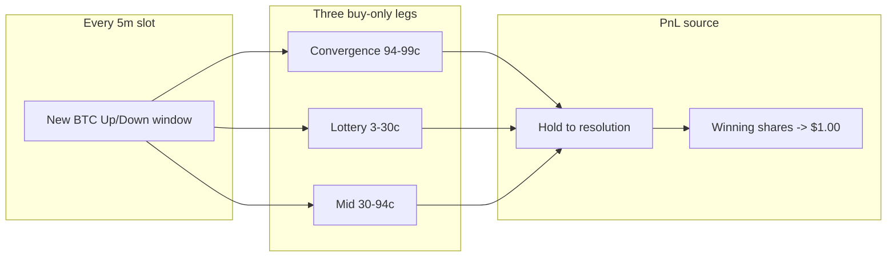
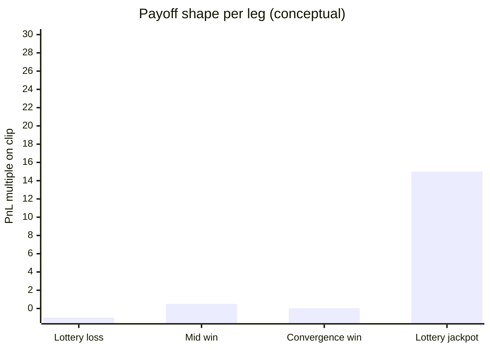

# Gabigol — Polymarket Crypto Up/Down Bot

Automated trading engine for Polymarket **crypto Up/Down** markets (BTC, ETH, SOL, XRP — 5m and 15m windows), implementing a **gabigol-style** strategy: high-frequency, buy-only, hold-to-redeem farming across thousands of micro-positions.

(https://polymarket.com/@gabigol) (`0x885278f0e304bc2d53f805af2ab779cb6011c569).

> **Disclaimer:** This describes observed public trading patterns and an independent reimplementation. It is **not financial advice**. Past results (e.g. ~$308K cumulative PnL on third-party trackers) do not guarantee future performance. Start with simulation and micro-size live clips.

---

## Table of contents

1. [The core idea — why this can be profitable](#the-core-idea--why-this-can-be-profitable)
2. [How money is made — the three legs](#how-money-is-made--the-three-legs)
3. [The math — convergence, lottery, and compounding](#the-math--convergence-lottery-and-compounding)
4. [Why win rate can be 60% and you still win](#why-win-rate-can-be-60-and-you-still-win)
5. [What kills the edge](#what-kills-the-edge)
6. [Visual walkthrough (screenshots)](#visual-walkthrough-screenshots)
7. [How this bot implements the strategy](#how-this-bot-implements-the-strategy)
8. [Quick start](#quick-start)
9. [Configuration reference](#configuration-reference)
10. [Simulation and validation](#simulation-and-validation)
11. [Production deployment](#production-deployment)
12. [Architecture](#architecture)
13. [Further reading](#further-reading)

---

## The core idea — why this can be profitable

Most Polymarket bots try to **predict** one outcome per slot and size up when a model says edge exists. The gabigol archetype is different:

**The edge is not one clever bet per market — it is statistical volume across tens of thousands of markets.**

Every 5-minute (or 15-minute) crypto slot is a binary market:

- Will BTC finish **above** the opening reference price (**UP** resolves to $1)?
- Or **below** it (**DOWN** resolves to $1)?

Shares trade between $0.00 and $1.00. At resolution, winning shares pay **$1.00**; losing shares pay **$0.00**.

The strategy runs **three concurrent scanners** on every active slot and almost **never sells**. Profit comes from **redemption at resolution**, not from exiting into the book. Over ~1.9M lifetime buys (observed on gabigol), that means:

| Behavior | Observed pattern |
|----------|------------------|
| Buy:Sell ratio | ~3,499 : 1 |
| Median clip | ~$1.92 |
| Markets traded | ~100K+ |
| Per-market win rate | ~60% |
| Profit factor | ~2.4× |
| Cumulative PnL (Struct, Jul 2026) | ~$308K on ~$20.6M volume |

A **60% market win rate** sounds mediocre until you see the payoff shape: thousands of small convergence clips (+1–6% each) plus occasional lottery jackpots (10×–30× on cheap tickets) compound faster than the full-premium losses on wrong-side lottery legs.



**Screenshot placeholder — market context**

<!-- Add: docs/screenshots/01-polymarket-updown-market.png -->


*A live crypto Up/Down slot: countdown, price to beat, UP/DOWN ask prices. Each row is one independent “coin flip with a clock.”*

---

## How money is made — the three legs

### Leg A — Convergence (~48% of buys) — the payroll engine

**When:** Last ~60–180 seconds of a slot (default: 120s).

**What:** The outcome is nearly decided — spot price vs “price to beat” strongly favors UP or DOWN. The **winning side** still has asks in the **94–99.5¢** range before the book fully closes.

**Action:** Burst **FOK** (fill-or-kill) buys in **~$2 clips** on the likely winner. Hold until resolution. Each winning share redeems at **$1.00**.

**Profit per winning ticket:** roughly **+1% to +6%** gross per share (e.g. buy at 98¢ → receive $1.00 = 2¢ / 98¢ ≈ 2% before fees).

This leg fires **most often** and **most reliably**. It is thin margin per trade, but gabigol runs it **thousands of times per day** across BTC, ETH, SOL, XRP 5m books simultaneously. That is the “noise farming” core.

**Screenshot placeholder — convergence book**

<!-- Add: docs/screenshots/02-orderbook-convergence.png -->


*Late-slot book: winner side clustered at 94–99¢. The bot sweeps these asks in rapid FOK bursts.*

---

### Leg B — Lottery (~21% of buys) — the tail-risk engine

**When:** Mid-slot, while uncertainty is still meaningful (default: 60–280 seconds remaining).

**What:** The **likely losing** side still trades at **3–30¢**. These are cheap “lottery tickets.”

**Action:** Small **~$0.50–$3** FOK clips on the underdog.

| Outcome | PnL on clip |
|---------|-------------|
| Underdog wins (upset) | **+300% to +3000%** (e.g. 10¢ → $1.00 = 10×) |
| Underdog loses | **−100%** of premium (lose the $1.50 clip) |

Losses are **capped** (you only lose the premium). Wins are **uncapped** in ratio terms. You do not need a high hit rate on lottery legs — a few upsets per week across thousands of clips can materially lift session PnL.

**Screenshot placeholder — lottery book**

<!-- Add: docs/screenshots/03-orderbook-lottery.png -->


*Mid-slot: loser side at 3–30¢. Small repeated clips; occasional huge payoff.*

---

### Leg C — Mid conviction (~31% of buys) — the filler

**When:** Rest of the slot, when convergence is not actively bursting.

**What:** Winner-side asks in the **30–94¢** band — directional conviction without endgame certainty.

**Action:** ~$1–$2 FOK clips on the likely winner. Lower edge per trade than convergence, but fills the gap between lottery spray and endgame sweeps.

---

### Both sides on the same market — by design

In observed data, **~42%** of conditions (61/144 in a 3,500-trade API sample) had **buys on both UP and DOWN** in the same slot. That is **not** classic arb (UP + DOWN < $1). It is:

- Lottery clips on the cheap loser **plus**
- Convergence clips on the expensive winner later in the slot, or
- Scaling into the wrong cheap side before a late flip.

Net PnL per slot can be: **small convergence win + total lottery loss**, or **lottery jackpot + convergence win**. The portfolio edge is across **volume**, not per-slot perfection.

**Screenshot placeholder — dual exposure**

<!-- Add: docs/screenshots/07-both-sides-same-slot.png -->


*Example: ETH Up 96.5¢ position and ETH Down 10.8¢ position in the same 5m window.*

---

## The math — convergence, lottery, and compounding

### Convergence — fee-aware edge

Polymarket charges **taker fees** on FOK orders. For crypto 5m/15m markets, fee rate ≈ **0.072**. Fee in shares:

```
fee = shares × 0.072 × price × (1 − price)
```

**Net edge per share** if the side wins and redeems at $1.00:

```
netEdge = 1 − price − (0.072 × price × (1 − price))
```

Implemented in [`engine/strategy/lib/fees.ts`](engine/strategy/lib/fees.ts) as `netEdgePerShare()`. The bot **skips** convergence buys when `netEdge < GABIGOL_MIN_EDGE` (default **0.5%**).

| Ask price | Gross edge (1 − price) | Approx. net edge after taker fee |
|-----------|------------------------|----------------------------------|
| 94¢ | 6.0% | ~5.6% |
| 96¢ | 4.0% | ~3.7% |
| 98¢ | 2.0% | ~1.6% |
| 99¢ | 1.0% | ~0.7% |

At **99¢**, fees eat most of the gross clip. Observed gabigol PnL includes **~$20.5K in maker/taker rebates** — at scale, rebates can turn fee-thin 99¢ farming from breakeven into positive expectancy. Smaller independent deployments may not get the same rebate tier.

**Example — one convergence clip**

- Buy **5 shares** UP @ **96¢** FOK → cost ≈ **$4.80**
- Side wins → redeem **5 × $1.00 = $5.00**
- Gross profit ≈ **$0.20** (~4.2% on cost)
- Repeat **500× per day** across 4 assets → small edges aggregate

### Lottery — asymmetric payoff

- Spend **$1.50** on DOWN @ **15¢** (~10 shares after fees)
- If DOWN loses: **−$1.50**
- If DOWN wins: **~$10.00** redemption → **+$8.50** (~5.7×)

Break-even hit rate for equal clip sizes: only **~15%** upset rate needed on lottery legs where average win is 6× premium. Observed upset rate is lower, but convergence profits subsidize lottery spray.

### Session-level compounding (observed gabigol stats)

| Metric | Value | Implication |
|--------|-------|-------------|
| Avg win (per market) | **+$33.6** | Convergence bursts + occasional lottery hits |
| Avg loss (per market) | **−$21** | Capped lottery premiums + wrong-side convergence |
| Profit factor | **2.4×** | Gross wins / gross losses |
| Max drawdown | **−$6K (−2.6%)** | Many small losses; rare large convergence mistakes |
| 30d PnL | **~$49K** | Requires capital, speed, and continuous uptime |



---

## Why win rate can be 60% and you still win

Traditional betting intuition: “You need >50% win rate.” Here, **win rate is measured per market (slot)**, not per individual buy.

- A single slot may have **50+ buys** (convergence burst + lottery + mid).
- **Per-market win rate ~60%** means 40% of slots net negative — often because lottery legs expired worthless or convergence bought the wrong side after a late flip.
- **Profit factor 2.4×** means winning slots earn **2.4× more dollars** than losing slots lose.

The strategy is profitable because:

1. **Convergence** contributes frequent small positive expectancy clips.
2. **Lottery** contributes positive skew (many −100% premia, rare +1000% hits).
3. **Volume** — law of large numbers across ~100K markets smooths variance.
4. **No sell friction** — no spread paid to exit; winners ride to $1.00.
5. **Rebates** (at scale) — fee program can offset taker cost on 99¢ sweeps.

**Screenshot placeholder — track record**

<!-- Add: docs/screenshots/04-gabigol-profile-struct.png -->


*Third-party analytics: cumulative PnL, volume, win rate, profit factor.*

---

## What kills the edge

| Risk | Mechanism | Mitigation in this bot |
|------|-----------|------------------------|
| **Fee erosion** | 99¢ → $1 is ~1% gross; taker fee can take most of it | `GABIGOL_MIN_EDGE`; skip thin convergence |
| **Wrong-side 99¢** | Late slot flip → buy loser at 98¢ → ~total loss | Optional `GABIGOL_MIN_GAP_USD`; tune convergence window |
| **Both-side bleed** | Lottery + convergence in same slot; one leg dies | Separate `GABIGOL_LOTTERY_CAP` / `GABIGOL_MID_CAP` |
| **Capital lock** | Thousands of open positions need float | `GABIGOL_MARKET_CAP`; wallet buffer ≥ $5K (gabigol runs $100K+) |
| **Competition** | More bots farm same 5m books → asks vanish faster | Speed, multi-asset fleet, rebate tier |
| **Regime change** | Polymarket fee/rebate rules or liquidity shift | Monitor; simulate before scaling |

---

## Visual walkthrough (screenshots)

Add images under [`docs/screenshots/`](docs/screenshots/). The README references them below — drop your files in place and they will render automatically.

| # | File | Purpose |
|---|------|---------|
| 1 | [`01-polymarket-updown-market.png`](docs/screenshots/01-polymarket-updown-market.png) | Market UI — slot, price to beat, UP/DOWN |
| 2 | [`02-orderbook-convergence.png`](docs/screenshots/02-orderbook-convergence.png) | Late-slot winner asks 94–99¢ |
| 3 | [`03-orderbook-lottery.png`](docs/screenshots/03-orderbook-lottery.png) | Mid-slot loser asks 3–30¢ |
| 4 | [`04-gabigol-profile-struct.png`](docs/screenshots/04-gabigol-profile-struct.png) | PnL / volume / win rate dashboard |
| 5 | [`05-simulation-chart.png`](docs/screenshots/05-simulation-chart.png) | Engine chart tool output |
| 6 | [`06-console-burst.png`](docs/screenshots/06-console-burst.png) | Terminal: burst fills, zero sells |
| 7 | [`07-both-sides-same-slot.png`](docs/screenshots/07-both-sides-same-slot.png) | Dual UP+DOWN exposure one slot |

**Screenshot placeholder — simulation chart**

<!-- Add: docs/screenshots/05-simulation-chart.png -->


*Interactive chart from a market log: order book, ticker, fills over time.*

**Screenshot placeholder — live console**

<!-- Add: docs/screenshots/06-console-burst.png -->


*`gabigol convergence` / `gabigol lottery` / `gabigol mid` lines — no SELL events.*

---

## How this bot implements the strategy

| Spec behavior | Implementation |
|---------------|----------------|
| Buy-only, hold-to-redeem | `ctx.blockSells()` in [`engine/strategy/gabigol.ts`](engine/strategy/gabigol.ts) |
| Convergence 94–99.5¢ | `PRICE_BANDS.convergence` + last `GABIGOL_CONVERGENCE_MAX_SECS` |
| Lottery 3–30¢ | `PRICE_BANDS.lottery` + time window 60–280s |
| Mid 30–94¢ | `PRICE_BANDS.mid` when convergence not bursting |
| FOK micro-clips | `orderType: "FOK"` via `ctx.postOrders()` |
| Winner inference | CEX spot vs `openPrice` in [`winner-inference.ts`](engine/strategy/lib/winner-inference.ts) |
| Fee gate | `netEdgePerShare() >= GABIGOL_MIN_EDGE` |
| Per-market caps | [`inventory.ts`](engine/strategy/lib/inventory.ts) |
| Auto-redeem (prod) | Engine lifecycle → `redeemPositions()` via gasless relayer |
| Multi-asset | [`scripts/run-gabigol.ts`](scripts/run-gabigol.ts) spawns btc/eth/sol/xrp processes |

**Tick loop (every 100ms default):**

```
1. Read remaining_seconds, openPrice, CEX spot
2. Infer likely winner (UP/DOWN) from spot vs price-to-beat
3. Lottery scanner  → FOK buy loser if ask ∈ [3¢, 30¢]
4. Convergence scan → burst FOK buy winner if ask ∈ [94¢, 99.5¢] and net edge OK
5. Mid scanner      → FOK buy winner if ask ∈ [30¢, 94¢] and convergence idle
6. At slot end      → hold releases; engine redeems winners
```

---

## Quick start

### Prerequisites

- Node.js 18+ (or [Bun](https://bun.sh))
- Polygon wallet funded with **pUSD** for production ([`docs/MIGRATE_V2.md`](docs/MIGRATE_V2.md))

### Install

```bash
git clone <this-repo> gabigol
cd gabigol
npm install          # or: bun install
cp .env.example .env
```

### Simulation (recommended first)

```bash
# Single asset, 20 rounds (~100 minutes real time for 5m windows)
npm run gabigol:sim

# Or explicitly:
npx tsx index.ts --strategy gabigol --slot-offset 1 --rounds 20 --always-log
```

Raise `MAX_SESSION_LOSS` (e.g. `200`) if you want the full 20 rounds without early shutdown on drawdown.

### Multi-asset fleet

```bash
npx tsx scripts/run-gabigol.ts
```

Spawns parallel processes: `btc`, `eth`, `sol`, `xrp` — each `MARKET_WINDOW=5m`.

### Production

```bash
# Edit .env: PRIVATE_KEY, POLY_FUNDER_ADDRESS, BUILDER_*, FORCE_PROD=true
npm run gabigol:prod

# Periodic batch redeem backup
npx tsx scripts/redeem.ts
```

---

## Configuration reference

### Engine (`.env`)

| Variable | Default | Description |
|----------|---------|-------------|
| `TICKER` | `polymarket,binance` | Price feeds for winner inference |
| `MARKET_ASSET` | `btc` | Per-process asset (`btc`/`eth`/`sol`/`xrp`) |
| `MARKET_WINDOW` | `5m` | `5m` or `15m` |
| `MAX_SESSION_LOSS` | `50` | Stop engine when cumulative losses exceed this |
| `WALLET_BALANCE` | `5000` | Simulated balance (paper trading) |
| `PRIVATE_KEY` | — | Required for `--prod` |
| `POLY_FUNDER_ADDRESS` | — | Polymarket proxy/funder wallet |
| `BUILDER_KEY/SECRET/PASSPHRASE` | — | Gasless relayer (redeem) |

### Gabigol strategy

| Variable | Default | Profitability role |
|----------|---------|-------------------|
| `GABIGOL_CLIP_NOTIONAL` | `2.0` | Convergence clip size — core payroll unit |
| `GABIGOL_MIN_EDGE` | `0.005` | Skip convergence when fee-adjusted edge < 0.5% |
| `GABIGOL_MARKET_CAP` | `200` | Max $ per slot — limits blow-up on wrong-side bursts |
| `GABIGOL_LOTTERY_CAP` | `30` | Caps lottery bleed per slot |
| `GABIGOL_LOTTERY_CLIP_NOTIONAL` | `1.5` | Lottery ticket size — controls tail variance |
| `GABIGOL_CONVERGENCE_MAX_SECS` | `120` | Endgame window length |
| `GABIGOL_BURST_PER_TICK` | `3` | FOK orders per 100ms tick in convergence |
| `GABIGOL_MIN_GAP_USD` | `0` | Require \|spot − open\| before trading (0 = aggressive) |

Full list: [`.env.example`](.env.example) and [`docs/GABIGOL.md`](docs/GABIGOL.md).

---

## Simulation and validation

After a sim session, verify profitability mechanics are firing correctly:

```bash
# Visual timeline of one slot
npx tsx scripts/chart.ts logs/early-bird-btc-updown-5m-*.log --open
```

**Checklist**

- [ ] `gabigol convergence` fills at 94–99¢ in final ~120s
- [ ] `gabigol lottery` fills at 3–30¢ mid-slot
- [ ] `gabigol mid` fills at 30–94¢
- [ ] **Zero** `SELL` lines in console or logs
- [ ] `Redemption successful` on resolved winners (prod/sim)
- [ ] Per-slot spend ≤ `GABIGOL_MARKET_CAP`

**Example sim outcome (BTC, 5 rounds before loss limit):**

- Session PnL reached **+$209** on **$5,000** sim wallet
- All three scanners logged hundreds of FOK fills
- Shutdown triggered by `MAX_SESSION_LOSS=$50` (tune upward for longer runs)

---

## Production deployment

1. **Fund pUSD** on your Polymarket proxy wallet.
2. **Simulate** ≥10 rounds; confirm burst/lottery patterns in charts.
3. **Set risk:** `MAX_SESSION_LOSS`, `GABIGOL_MARKET_CAP` for your bankroll.
4. **Run fleet:** `npm run gabigol:prod` (4 assets × 5m).
5. **Redeem:** engine auto-redeems; also run `npx tsx scripts/redeem.ts` after sessions.
6. **Monitor:** wallet balance, fill rate, convergence rejection rate, session PnL.

**Capital guidance (from observed gabigol scale)**

| Parameter | Gabigol-like | Small independent start |
|-----------|--------------|---------------------------|
| Wallet buffer | $100K+ pUSD | $5K–$10K |
| Per-clip notional | $1.50–$2.00 | $1.00–$2.00 |
| Per-market cap | $50–$300 | $20–$50 |
| Concurrent markets | Many (4 assets × continuous slots) | 1–4 processes |

---

## Architecture

```
┌──────────────────────────────────────────────────────────────┐
│  scripts/run-gabigol.ts                                      │
│    ├── process: MARKET_ASSET=btc  → EarlyBird + gabigol      │
│    ├── process: MARKET_ASSET=eth  → EarlyBird + gabigol      │
│    ├── process: MARKET_ASSET=sol  → EarlyBird + gabigol      │
│    └── process: MARKET_ASSET=xrp  → EarlyBird + gabigol      │
└──────────────────────────────────────────────────────────────┘
                              │
                              ▼
┌──────────────────────────────────────────────────────────────┐
│  EarlyBird engine (per process)                              │
│    MarketLifecycle per slot → gabigol strategy tick loop     │
│    CLOB WS order book + CEX ticker + FOK placement           │
│    Resolution → redeemPositions (gasless relayer)            │
└──────────────────────────────────────────────────────────────┘
```

**Key files**

```
engine/strategy/gabigol.ts              # Three scanners, blockSells, hold-to-redeem
engine/strategy/lib/fees.ts             # Taker fee + net edge
engine/strategy/lib/inventory.ts        # Per-slot spend caps
engine/strategy/lib/winner-inference.ts # UP/DOWN from spot vs open
scripts/run-gabigol.ts                  # Multi-asset launcher
```

---

## Further reading

| Doc | Contents |
|-----|----------|
| [`docs/GABIGOL.md`](docs/GABIGOL.md) | Strategy params, risks, prod checklist |
| [`docs/GUIDE.md`](docs/GUIDE.md) | Engine API, strategy development |
| [`docs/LEARNING.md`](docs/LEARNING.md) | Prediction markets primer |
| [`docs/MIGRATE_V2.md`](docs/MIGRATE_V2.md) | USDC.e → pUSD migration |
| [`docs/screenshots/`](docs/screenshots/) | Drop visual assets here |

---

## License

MIT — engine from [KaustubhPatange/polymarket-trade-engine](https://github.com/KaustubhPatange/polymarket-trade-engine). Gabigol strategy implementation and documentation in this fork.
